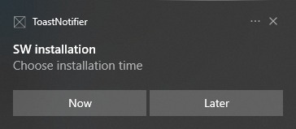

Custom Windows "toast" notification application. Intended as replacement for the in-built "toast" viewer on embedded systems where `explorer.exe` is _not_ running due to a [custom shell](https://docs.microsoft.com/en-us/windows/configuration/kiosk-shelllauncher). Based on the Toast [Notification listener](https://docs.microsoft.com/en-us/windows/apps/design/shell/tiles-and-notifications/notification-listener) article.

**LIMITATION**: Actions like **buttons are _not_ supported**, since they do not appear to be accessible through the API.

Related forum questions:
* https://techcommunity.microsoft.com/t5/microsoft-intune/install-amp-restart-notifications-when-using-custom-shell/m-p/3300210 (answer suggested to workaround the problem with PSAppDeployToolkit)
* https://docs.microsoft.com/en-us/answers/questions/836756/how-to-access-actionsbuttons-from-windowsuinotific.html (answer suggested that this is not possible with the current API)
* https://github.com/microsoft/WindowsAppSDK/discussions/2471

## Example screenshots
Original toast notification:

 

Custom display of the same toast notification:

 
